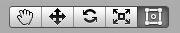
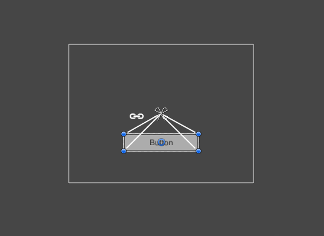

# لی اوت پایه

## ابزار rect

The Rect Tool

هر عنصر رابط کاربری (UI) برای اهداف چیدمان (Layout) به صورت یک مستطیل نمایش داده می‌شود. این مستطیل را می‌توان در نمای صحنه (Scene View) با استفاده از ابزار مستطیل (Rect Tool) که در نوار ابزار قرار دارد، دستکاری کرد. ابزار مستطیل هم برای ویژگی‌های دوبعدی یونیتی و هم برای UI به کار می‌رود و در واقع، حتی برای اشیاء سه‌بعدی نیز قابل استفاده است.

<small>دکمه های تولبار که در اینجا ابزار Rect (The Rect Tool) انتخاب شده است</small>

از ابزار مستطیل (Rect Tool) می‌توان برای جابجایی، تغییر اندازه و چرخاندن عناصر UI استفاده کرد. هنگامی که یک عنصر UI را انتخاب کردید، می‌توانید با کلیک کردن در هر جای داخل مستطیل و کشیدن (drag)، آن را جابجا کنید. با کلیک بر روی لبه‌ها یا گوشه‌ها و کشیدن، می‌توانید اندازه آن را تغییر دهید. برای چرخاندن عنصر، نشانگر ماوس را کمی دورتر از گوشه‌ها نگه دارید تا به شکل نماد چرخش درآید. سپس می‌توانید کلیک کرده و در هر جهتی بکشید تا آن را بچرخانید.

همانند سایر ابزارها، ابزار مستطیل نیز از حالت پیوت (pivot mode) و فضای (space) فعلی که در نوار ابزار تنظیم شده است، استفاده می‌کند. هنگام کار با UI معمولاً بهتر است که این تنظیمات را روی Pivot (مرکز) و Local (محلی) نگه دارید.

## Rect Transform

کامپوننت Rect Transform یک کامپوننت transform جدید است که به جای کامپوننت Transform معمولی، برای تمام عناصر UI استفاده می‌شود.

کامپوننت‌های Rect Transform نیز درست مانند Transformهای معمولی دارای موقعیت (position)، چرخش (rotation) و مقیاس (scale) هستند، اما علاوه بر آن، عرض (width) و ارتفاع (height) نیز دارند که برای مشخص کردن ابعاد مستطیل به کار می‌رود.

## تغییر اندازه (Resizing) در مقابل تغییر مقیاس (Scaling)

هنگامی که از ابزار مستطیل (Rect Tool) برای تغییر اندازه یک شیء استفاده می‌شود، معمولاً برای اسپرایت‌ها (Sprites) در سیستم دوبعدی و برای اشیاء سه‌بعدی، این کار مقیاس محلی (local scale) آن شیء را تغییر می‌دهد. اما، وقتی این ابزار روی یک شیء که دارای کامپوننت Rect Transform است به کار رود، به جای آن، عرض (width) و ارتفاع (height) را تغییر می‌دهد و مقیاس محلی را دست‌نخورده باقی می‌گذارد. این نوع تغییر اندازه، روی اندازه فونت‌ها یا حاشیه‌های تصاویر برش‌خورده (sliced images) تأثیری نخواهد گذاشت.

## پیوت (Pivot)

چرخش‌ها، تغییرات اندازه و تغییرات مقیاس حول محور پیوت (pivot) رخ می‌دهند، بنابراین موقعیت پیوت بر نتیجه‌ی یک چرخش، تغییر اندازه یا تغییر مقیاس تأثیر می‌گذارد. هنگامی که دکمه Pivot در نوار ابزار روی حالت Pivot mode تنظیم شده باشد، می‌توان پیوت یک Rect Transform را در نمای صحنه (Scene View) جابجا کرد

## انکرها (Anchors)

کامپوننت‌های Rect Transform شامل یک مفهوم چیدمان به نام انکر (لنگر) هستند. انکرها به صورت چهار دستگیره مثلثی کوچک در نمای صحنه (Scene View) نمایش داده می‌شوند و اطلاعات مربوط به انکرها در اینسپکتور (Inspector) نیز قابل مشاهده است.

اگر والد (parent) یک Rect Transform، خودش نیز یک Rect Transform باشد، می‌توان Rect Transform فرزند را به روش‌های مختلفی به Rect Transform والد لنگر انداخت. به عنوان مثال، فرزند می‌تواند به مرکز والد یا به یکی از گوشه‌های آن لنگر شود.

عنصر رابط کاربری که به مرکز عنصر والد متصل شده است. این عنصر یک فاصله ثابت نسبت به مرکز را حفظ می‌کند.

عنصر رابط کاربری به گوشه پایین سمت راست عنصر والد متصل شده است. این عنصر یک فاصله ثابت نسبت به گوشه پایین سمت راست را حفظ می‌کند.

انکرینگ (لنگر انداختن) همچنین به فرزند اجازه می‌دهد تا همراه با عرض یا ارتفاع والد، کش بیاید. هر گوشه از مستطیل [فرزند] یک فاصله (offset) ثابت تا انکر متناظر خود دارد؛ یعنی، گوشه بالا-چپ مستطیل یک فاصله ثابت تا انکر بالا-چپ دارد و به همین ترتیب برای سایر گوشه‌ها. به این روش، گوشه‌های مختلف مستطیل [فرزند] می‌توانند به نقاط متفاوتی در مستطیل والد لنگر شوند.

عنصر رابط کاربری که گوشه‌های چپ آن به گوشه پایین سمت چپ عنصر والد و گوشه‌های راست آن به گوشه پایین سمت راست متصل شده‌اند. گوشه‌های عنصر، فاصله‌های ثابتی را نسبت به لنگرهای مربوطه خود حفظ می‌کنند.

:::tip
یعنی هر گوشه از فرزند تلاش می کنه تا فاصله خودش را تا انکر متناظر در والد حفظ کنم
و این موضوع باعث جابجایی یا کشده شدن می شود.
:::

موقعیت انکرها به صورت کسر (یا درصد) از عرض و ارتفاع مستطیل والد تعریف می‌شود. مقدار 0.0 (۰٪) معادل با لبه چپ یا پایین، 0.5 (۵۰٪) معادل با وسط، و 1.0 (۱۰۰٪) معادل با لبه راست یا بالا است. اما انکرها به لبه‌ها و وسط محدود نمی‌شوند؛ آنها می‌توانند به هر نقطه‌ای در داخل مستطیل والد لنگر شوند.

:::tip
یعنی مین ها انکر های چپ و پایین هستند و مکس ها انکر های راست و بالا.
موقعیت انکر ها عددی بین 0 تا 1 است که 0 پایین و چپ را نشان می دهد و 1 بالا و راست. و این 0 و 1 بر اساس اندازه مستطیل والد تعیین می شوند.
:::

عنصر رابط کاربری که گوشه‌های چپ آن به نقطه‌ای با درصد مشخصی از سمت چپ مستطیل والد متصل شده‌اند و گوشه‌های راست آن به نقطه‌ای با درصد مشخصی از سمت راست مستطیل والد متصل شده‌اند.

شما می‌توانید هر یک از انکرها را به صورت جداگانه بکشید، یا اگر در یک نقطه جمع شده‌اند، می‌توانید با کلیک کردن در وسط آن‌ها و کشیدن، همگی را با هم جابجا کنید. اگر هنگام کشیدن یک انکر، کلید Shift را پایین نگه دارید، گوشه‌ی متناظر مستطیل نیز همراه با انکر حرکت خواهد کرد.

یک ویژگی مفید دستگیره‌های انکر این است که آن‌ها به طور خودکار به انکرهای مستطیل‌های هم‌سطح (sibling) می‌چسبند تا موقعیت‌یابی دقیق را ممکن سازند.

## پیش‌تنظیمات انکر (Anchor Presets)

در اینسپکتور، دکمه پیش‌تنظیم انکر را می‌توان در گوشه بالا سمت چپ کامپوننت Rect Transform پیدا کرد. کلیک کردن روی این دکمه، منوی کشویی پیش‌تنظیمات انکر را باز می‌کند. از اینجا می‌توانید برخی از رایج‌ترین گزینه‌های لنگراندازی را انتخاب کنید. شما می‌توانید عنصر UI را به لبه‌ها یا وسط والد لنگر کنید، یا آن را همراه با اندازه والد کش بدهید. لنگراندازی افقی و عمودی از یکدیگر مستقل هستند.

دکمه‌های «تنظیمات از پیش تعیین‌شده‌ی لنگر» (Anchor Presets) در صورت وجود، گزینه‌ی از پیش تعیین‌شده‌ی انتخاب‌شده‌ی فعلی را نمایش می‌دهند. اگر لنگرهای روی محور افقی یا عمودی در موقعیت‌های متفاوتی نسبت به هر یک از پیش‌تنظیم‌ها تنظیم شده باشند، گزینه‌های سفارشی نمایش داده می‌شوند.

## فیلدهای لنگر و موقعیت در اینسپکتور

شما می‌توانید روی فلش بازشونده‌ی Anchors کلیک کنید تا فیلدهای عددی انکرها را در صورتی که قابل مشاهده نیستند، آشکار سازید. Anchor Min متناظر با دستگیره انکر پایین-چپ در نمای صحنه (Scene View) و Anchor Max متناظر با دستگیره انکر بالا-راست است.
فیلدهای موقعیتِ مستطیل، بسته به اینکه انکرها در یک نقطه جمع شده باشند (که منجر به عرض و ارتفاع ثابت می‌شود) یا از هم جدا باشند (که باعث می‌شود مستطیل همراه با مستطیل والد کش بیاید)، به شکل متفاوتی نمایش داده می‌شوند.

هنگامی که تمام دستگیره‌های انکر در یک نقطه جمع شده‌اند، فیلدهایی که نمایش داده می‌شوند عبارتند از: Pos X، Pos Y، Width و Height. مقادیر Pos X و Pos Y موقعیت پیوت (pivot) را نسبت به انکرها نشان می‌دهند.
هنگامی که انکرها از هم جدا هستند، فیلدها می‌توانند به صورت جزئی یا کامل به Left، Right، Top و Bottom تغییر کنند. این فیلدها، فاصله‌گذاری داخلی (padding) را در داخل مستطیلی که توسط انکرها تعریف شده، مشخص می‌کنند. فیلدهای Left و Right زمانی استفاده می‌شوند که انکرها به صورت افقی از هم جدا باشند و فیلدهای Top و Bottom زمانی استفاده می‌شوند که به صورت عمودی جدا باشند.

:::tip
به صورت خلاصه موارد left , right , top ,bottom فاصله از ضلع مربوطه مستطیل تشکیل شده توسط انکر های خود المنت را نشان می دهند.
:::

توجه داشته باشید که تغییر مقادیر در فیلدهای انکر یا پیوت، به طور معمول باعث تنظیم متقابل مقادیر موقعیت‌یابی می‌شود تا مستطیل در جای خود ثابت بماند. در مواردی که این رفتار مطلوب نیست، با کلیک بر روی دکمه R در اینسپکتور، حالت ویرایش خام (Raw Edit Mode) را فعال کنید. این کار باعث می‌شود که مقادیر انکر و پیوت بتوانند بدون تغییر هیچ مقدار دیگری، عوض شوند. این عمل به احتمال زیاد باعث حرکت یا تغییر اندازه بصری مستطیل خواهد شد، زیرا موقعیت و اندازه آن به مقادیر انکر و پیوت وابسته است.

:::tip
واحد های left , right , top ,bottom , height , width  همگی بر اساس پیکسل است.
:::
